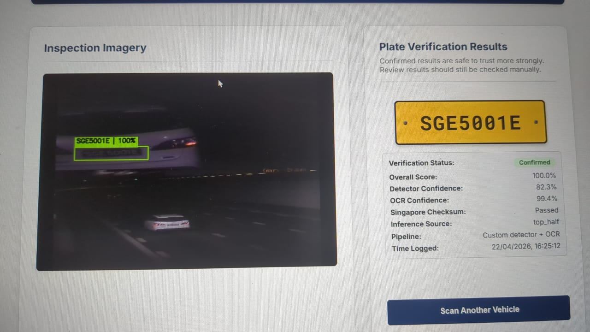
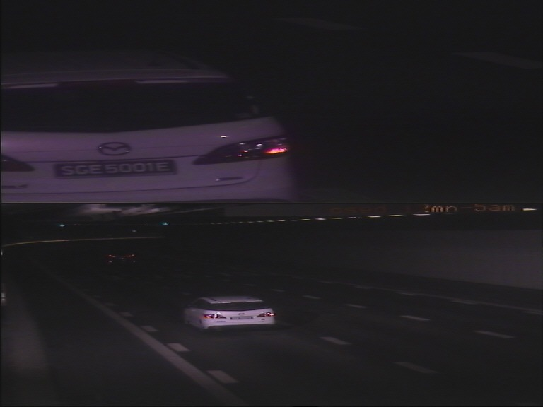
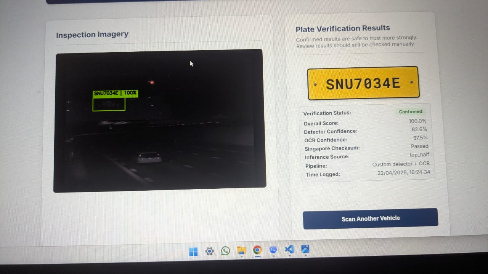

# Singapore Number Plate Detection in Harsh Tunnel Imagery

<div align="center">
  <p>
    A low-light ALPR project built for dark tunnel frames, long-range vehicles, weak contrast, and hard-to-read rear plates.
    The system is specifically designed for <strong>Singapore number plates</strong>, while also being able to surface
    non-Singapore plate-like text for manual review.
  </p>

  <p>
    
    
    
    
    
    
  </p>
</div>

<p align="center">
  
</p>

## Overview

This project is a web-based Automatic License Plate Recognition (ALPR) system that focuses on one of the hardest practical cases: detecting number plates from very dark tunnel surveillance images.

The pipeline combines:

- a custom YOLO plate detector (`best.pt`)
- OCR using `fast-plate-ocr`
- a fallback ALPR path using `fast-alpr`
- Singapore-specific format and checksum validation
- low-light enhancement and top-half focused recovery for tunnel frames

The main goal is not just to read a plate from a clean image. The goal is to recover usable plate text from frames where the vehicle is far away, the lighting is poor, and the plate occupies only a small portion of the image.

## What Makes This Project Different

- Built for harsh tunnel imagery rather than clean daylight samples
- Optimized for rear-facing Singapore plates in low-light traffic scenes
- Uses multiple image enhancement and OCR variants before making a decision
- Includes Singapore checksum validation to improve trust in final results
- Shows either a confirmed result or a manual-review result instead of silently failing
- Can also surface generic plate-like text outside Singapore format, but Singapore validation remains the primary design target

## Example Results

| Harsh tunnel input | Application result |
| --- | --- |
|  |  |

<p align="center">
  
</p>

These examples show the intended use case of the project:

- very dark tunnel images
- vehicles captured from a distance
- low-contrast or partially blurred plates
- Singapore plates that still need robust OCR and validation

## Detection Pipeline


## How The System Works

### 1. Focused image preparation

Tunnel images often place the vehicle in the upper half of the frame, while the lower half contains road and background noise.  
This project gives extra attention to top-half crops and low-light enhanced versions of the input image.

### 2. Plate detection

The custom `best.pt` model is used as the primary detector.  
For difficult tunnel frames, the detector is allowed to be more forgiving on focused top-half passes so valid plates are not dropped too early.

### 3. OCR with multiple variants

Each plate crop is passed through several OCR-friendly variants such as:

- sharpened crops
- CLAHE-enhanced crops
- grayscale CLAHE crops
- gamma corrected crops
- upscaled versions for small plates

The model then consolidates the strongest OCR candidates.

### 4. Singapore-specific validation

For Singapore plates, the pipeline validates:

- plate structure
- prefix and suffix rules
- checksum consistency

This helps separate strong detections from weak guesses.

### 5. Review-aware output

If the system has a trustworthy Singapore match, it returns a confirmed result.  
If the image is too difficult for a strict confirmation, it returns the strongest review candidate with a human-confirmation label.

## Supported Behavior

### Best supported

- Singapore number plates
- rear vehicle tunnel frames
- dark and low-contrast surveillance images
- small plate regions that need focused recovery

### Also supported in a broader sense

The OCR and fallback recovery path can surface plate-like detections from non-Singapore formats as well.  
However, the strong validation logic in this project is specifically built for Singapore plates, so this should be understood as a Singapore-first ALPR system rather than a country-specific validator for every plate format in the world.

## Tech Stack

- Python 3.10
- Flask
- Ultralytics YOLO
- OpenCV
- fast-plate-ocr
- fast-alpr
- custom Singapore plate heuristics

## Project Structure

```text
vehicle-number-plate-detection-using-ML/
|-- app.py
|-- step3_heuristics.py
|-- best.pt
|-- requirements.txt
|-- README.md
|-- static/
|   |-- main.js
|   `-- style.css
|-- templates/
|   `-- index.html
`-- docs/
    `-- images/
```

Runtime note:

- the `uploads/` folder is created automatically when the application starts

## Installation

### 1. Clone the repository

```powershell
git clone https://github.com/guru8880/vehicle-number-plate-detection-using-ML.git
cd vehicle-number-plate-detection-using-ML
```

### 2. Create a virtual environment

```powershell
python -m venv venv
venv\Scripts\activate
```

### 3. Install dependencies

```powershell
pip install -r requirements.txt
```

## Run The Application

```powershell
python app.py
```

The Flask app starts on:

```text
http://127.0.0.1:5000/
```

## Required Files

Make sure the following files are present in the project root:

- `app.py`
- `step3_heuristics.py`
- `best.pt`
- `requirements.txt`

## Output Modes

The system returns one of the following result styles:

- `Confirmed`  
  A strong Singapore plate match with high confidence and valid formatting/checksum support.

- `Waiting for human confirmation`  
  A useful recovery result that should still be checked manually, especially on very harsh tunnel frames.

## Why This Project Matters

Many plate detection demos work well on clean benchmark images, but fail when the image becomes truly difficult.  
This project was built around the difficult case first:

- harsh tunnel lighting
- low visibility
- small plates
- difficult OCR crops
- real-world review workflow

That is why the system uses image enhancement, focused crops, fallback recovery, and Singapore-specific validation together instead of relying on a single model output.

## Limitations

- The strongest validation rules are specific to Singapore plate formatting
- Extremely blurred or fully occluded plates may still require manual review
- Very unusual international plate formats are not validated with country-specific rules in this version

## Future Improvements

- add batch evaluation and benchmark reporting
- add more training data for extreme tunnel failure cases
- support country-specific validators beyond Singapore
- export structured detection logs for audit workflows
- improve review-mode explainability in the UI

## Repository

GitHub: [guru8880/vehicle-number-plate-detection-using-ML](https://github.com/guru8880/vehicle-number-plate-detection-using-ML)

---

If you are reviewing this project from a portfolio, academic, or engineering perspective, the key point is simple:

this is not just a number plate reader for clean images; it is a low-light Singapore ALPR system designed to recover useful results from difficult tunnel surveillance frames.
